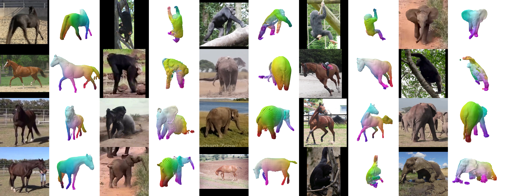

# _BAT3R_: Bootstrapping Articulated 3D Reconstruction from 2D Image Collections (ECCV 2026 🥳)

[Jakub Zadrożny](https://jakubzadrozny.github.io/), 
[Oisin Mac Aodha](https://homepages.inf.ed.ac.uk/omacaod), 
[Hakan Bilen](https://homepages.inf.ed.ac.uk/hbilen) | 
University of Edinburgh | **[🔗 Project Page](https://jakubzadrozny.github.io/bat3r/)** | 
**[📝 Paper](https://arxiv.org/abs/2607.03891)**

This repository will contain the official implementation of **_[BAT3R](https://jakubzadrozny.github.io/bat3r/)_** using [PyTorch](https://pytorch.org/).

**Code is coming soon!** (Leave a ⭐️ if you're interested!)
