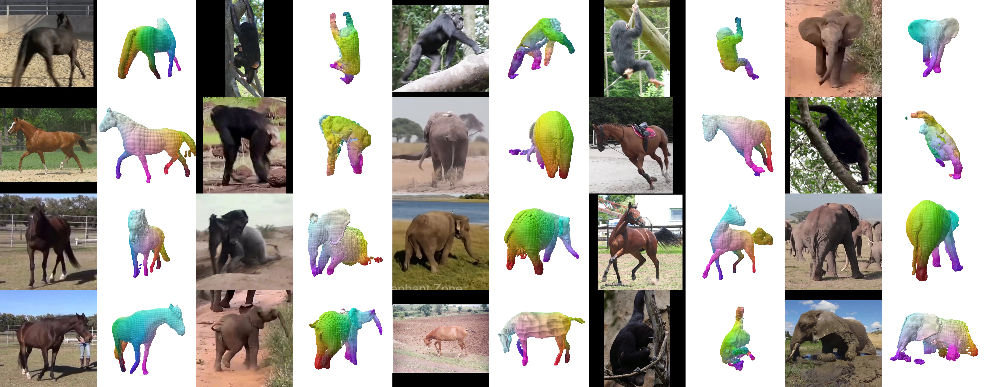

# _BAT3R_: Bootstrapping Articulated 3D Reconstruction from 2D Image Collections (ECCV 2026 🥳)

[Jakub Zadrożny](https://jakubzadrozny.github.io/), 
[Oisin Mac Aodha](https://homepages.inf.ed.ac.uk/omacaod), 
[Hakan Bilen](https://homepages.inf.ed.ac.uk/hbilen) | 
University of Edinburgh | **[🔗 Project Page](https://jakubzadrozny.github.io/bat3r/)** | 
**[📝 Paper](https://arxiv.org/abs/2607.03891)**



This is the official implementation of **_[BAT3R](https://jakubzadrozny.github.io/bat3r/)_** using [PyTorch](https://pytorch.org/).

> 3D reconstruction of articulated objects from a single image is challenging because large training datasets with paired image and 3D supervision are difficult to obtain. Recent point map-based methods achieve strong performance but rely on synthetic datasets rendered from manually created articulated 3D assets with carefully curated pose distributions. While camera viewpoints can be easily sampled, generating realistic object articulations remains costly and labor-intensive. We propose a training framework that reduces this requirement by leveraging unannotated 2D images collections with only a single rigged canonical mesh per category. Starting from a weak 3D shape predictor trained on canonical-pose renders, we iteratively estimate object articulation and camera pose by fitting the mesh to predicted point maps. The recovered articulations and viewpoints are then used to render updated synthetic training data, progressively improving the predictor. Despite using substantially weaker 3D supervision, our models achieve performance comparable with DualPM, which requires manually curated articulated training datasets.

## 🛠️ Installation

We recommend using [Anaconda](https://www.anaconda.com/) to set up a Python environment.

Create and activate a virtual environment:
```bash
conda create -n bat3r python=3.10 -y
conda activate bat3r
```

Install BAT3R in editable mode:
```bash
pip install -e .
```

## 🧑‍🍳 Data Preparation

Organize your training data as follows:
```
data/
└── <category>/
    ├── images/
    │   ├── 000000_rgb.png
    │   └── ...
    ├── masks/
    │   ├── 000000_mask.png
    │   └── ...
    └── shapes/
        └── <shape>_shape.gltf
```

## 🧠 Run Evaluation

To run inference on an image collection using a trained model:
```bash
python scripts/infer.py --config-name infer weights_path=checkpoints/weights.pth
```
Predicted canonical and posed point clouds will be exported as `.ply` files to the output directory.

## 🚀 Train Your Own Model

### Multi-GPU Distributed Training
We use [Hugging Face Accelerate](https://huggingface.co/docs/accelerate) for distributed training.

To launch training on multiple GPUs:
```bash
accelerate launch --gpu_ids=0,1,2,3 --num_processes=4 scripts/train_distrib.py
```

Training checkpoints and logs will be written to `checkpoints/`.

## 🏅 Acknowledgement

Our implementation builds upon [DualPM](https://dualpm.github.io/). We thank the authors for their open-source contributions.

## 📖 Citation

If you find this work useful for your research, please consider citing our paper:
```bibtex
@inproceedings{zadrozny2026bat3r,
  author    = {Zadro{\.z}ny, Jakub and Mac Aodha, Oisin and Bilen, Hakan},
  title     = {BAT3R: Bootstrapping Articulated 3D Reconstruction from 2D Image Collections},
  booktitle = {Proceedings of the European Conference on Computer Vision (ECCV)},
  year      = {2026}
}
```
